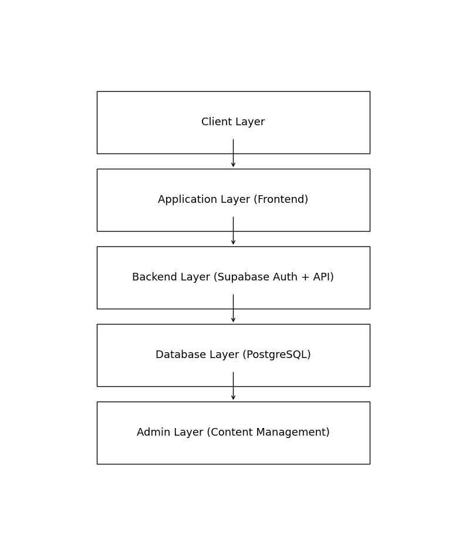

# Schnief-News – Full-Stack Financial Analysis Platform (Technical Showcase)

## Overview
Schnief-News is a privately developed full-stack financial analysis platform designed for structured market publishing within a role-based access system.

This repository provides a technical overview of the system architecture without exposing production source code.

## Tech Stack
- Supabase (PostgreSQL database + Authentication)
- Role-based access control
- Admin content management system
- Dynamic frontend rendering
- Full-stack web architecture

## Core Architecture
The platform consists of:

- Supabase authentication system
- PostgreSQL database for structured content storage
- Admin dashboard for asset & analysis creation and publishing, for Membermanagement and User Data analytics
- Role-based access control (Guest / Member / Supporter / Moderator / Admin / Owner)
- Protected content routing
- Inbox ticket system between User and Team

## Key Features
- Secure login and user management
- Role-based content visibility
- Admin-controlled publishing workflow
- Structured analysis storage
- Database-driven content rendering

## Development Focus
- Backend structure and database design
- Access control logic
- Content management architecture
- Scalable web platform structure

## System Architecture

## Notes
This repository serves as a technical showcase. Production code remains private.
